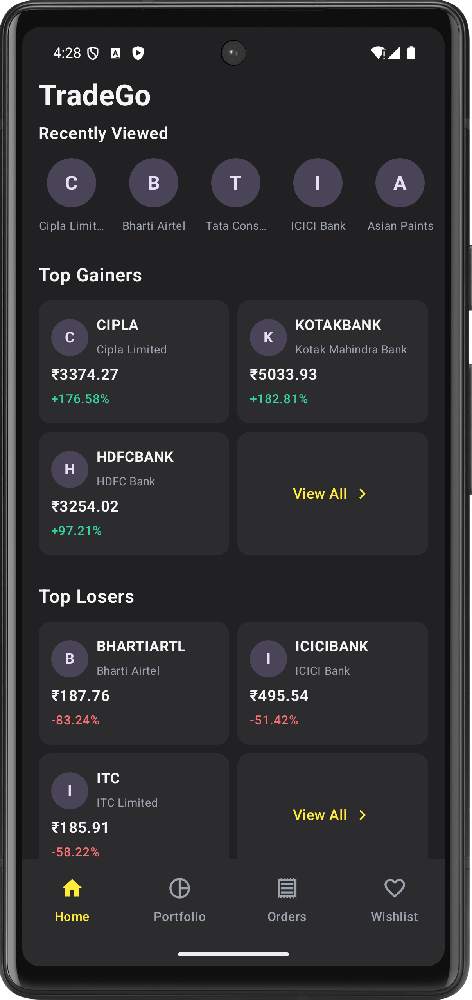
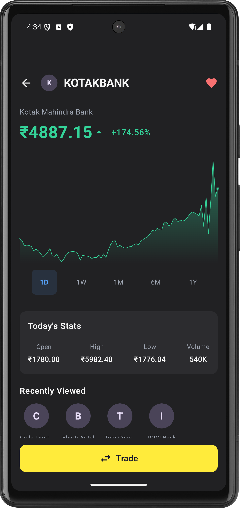
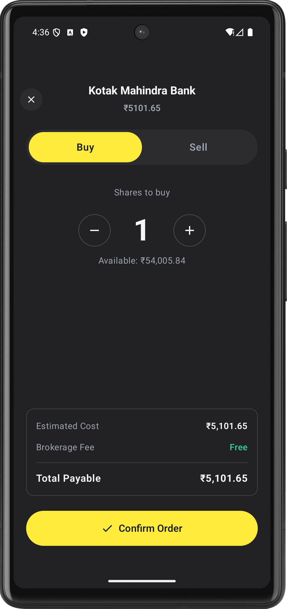
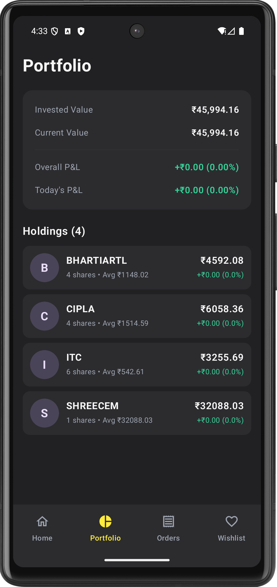
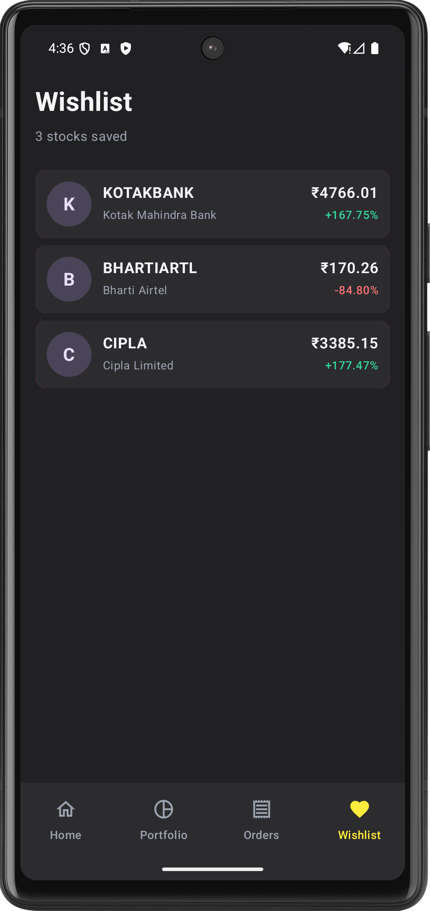

# TradeGo

A modern Android stock trading app built with Jetpack Compose, Ktor server, and real-time WebSocket updates.

## Tech Stack

| Layer | Technology |
|-------|-----------|
| UI | Jetpack Compose, Material 3 |
| Architecture | MVVM, MVI (Home) |
| DI | Hilt |
| Network | Ktor Client, OkHttp WebSocket |
| Local DB | Room |
| Server | Ktor Server (Kotlin) |
| Serialization | Kotlinx Serialization |
| Image Loading | Coil |

## Features

- **Real-time prices** via WebSocket — live updates on home, detail, and portfolio screens
- **Buy/Sell orders** with async confirmation flow (API returns PENDING → WebSocket delivers final status)
- **Portfolio tracking** with invested value, current value, overall P&L, and today's P&L
- **Order management** — pending, failed, and canceled orders with auto-cleanup
- **Wishlist** — save and swipe-to-remove stocks
- **Recently viewed** — last 5 stocks shown on home and detail screens
- **Biometric / PIN authentication** on app launch
- **Light & Dark mode** — system-driven with custom theme (yellow accent)
- **Stock logo fallback** — shows first letter when image fails to load

## Screenshots

<p align="center">
  
  
  
  
  
</p>

## Project Structure

```
StockApp/
├── app/                    # Android app
│   └── src/main/java/.../
│       ├── data/           # Repository, Room DB, API, WebSocket
│       ├── di/             # Hilt modules
│       ├── domain/model/   # Domain models
│       ├── ui/             # Compose screens & components
│       └── util/           # Constants, Biometric helper
├── server/                 # Ktor backend server
│   └── src/main/kotlin/.../
│       ├── data/           # StockManager, WebSocketManager
│       ├── models/         # Server DTOs
│       └── routes/         # API & WebSocket routes
└── screenshots/            # App screenshots
```

## Setup

1. Clone the repo
2. Start the server:
   ```bash
   cd server
   ./gradlew run
   ```
3. Update the server IP in `app/.../util/Constants.kt`
4. Build and run the Android app from Android Studio
